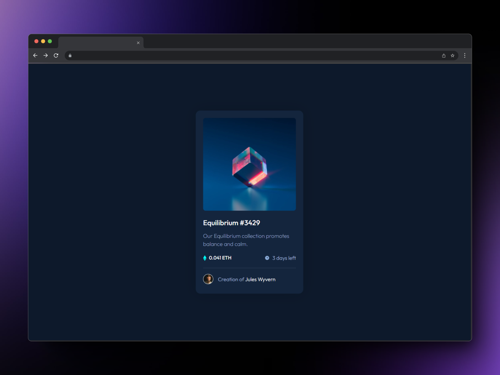
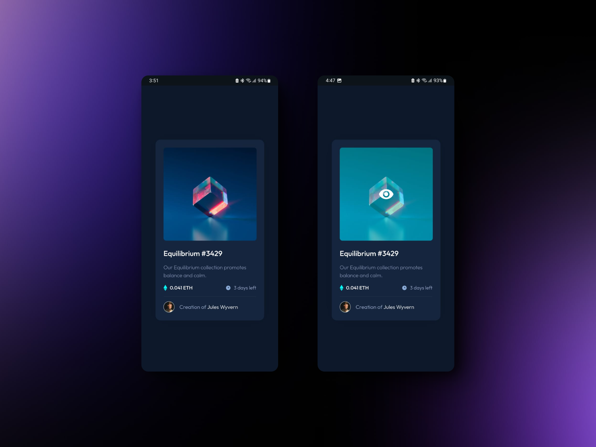

# NFT preview card component

This project was created using Vite.js, a fast and modern build tool for web projects.

## Getting Started

To get started with the project, you'll need to use the following scripts:

### Development Server

To start the development server, run:
```
pnpm run dev
```
This command starts a local development server with hot module replacement, allowing you to see your changes in real-time as you edit your code.
### Build for Production

To start the development server, run:
```
pnpm run build
```
This command bundles your application into static files for production. It optimizes the output for the best performance.
### Preview Production Build

To start the development server, run:
```
pnpm run preview
```
This command serves the files generated from the build command locally, allowing you to inspect the production build and ensure it works as expected before deploying.

# Frontend Mentor - NFT preview card component solution

This is a solution to the [NFT preview card component challenge on Frontend Mentor](https://www.frontendmentor.io/challenges/nft-preview-card-component-SbdUL_w0U). Frontend Mentor challenges help you improve your coding skills by building realistic projects. 

## Table of contents

- [Overview](#overview)
  - [The challenge](#the-challenge)
  - [Screenshot](#screenshot)
  - [Links](#links)
- [My process](#my-process)
  - [Built with](#built-with)
  - [What I learned](#what-i-learned)
  - [Continued development](#continued-development)
  - [Useful resources](#useful-resources)
- [Author](#author)

## Overview

### The challenge

Users should be able to:

- View the optimal layout depending on their device's screen size
- See hover states for interactive elements

### Screenshot




### Links

- Solution URL: [Repository Github here](https://your-solution-url.com)
- Live Site URL: [Deploy at Vercel here](https://nft-preview-card-component-main-eight-bice.vercel.app/)

## My process

### Built with

- Semantic HTML5 markup
- Flexbox
- Mobile-first workflow
- [Tailwindcss](https://tailwindcss.com/) - CSS framework
- [React](https://reactjs.org/) - JS library
- [Vite js](https://vitejs.dev/) - Next Generation Frontend Tooling

### What I learned

I learned to think in React components.

### Continued development

To continue perfecting my skills in frontend technologies such as React.js and TypeScript.

### Useful resources

- [Microsoft PowerToys](https://learn.microsoft.com/es-es/windows/powertoys/) - For Windows users, I highly recommend the tool 'Microsoft PowerToys' to improve development speed and experience, especially for Frontend Mentor users who do not have access to Figma files. For instance, within PowerToys, you will find tools such as a color picker, screen ruler, and more.

## Author

- Frontend Mentor - [@GonzaloGC](https://www.frontendmentor.io/profile/GonzaloGC)
- Twitter - [@gonzaloelias](https://twitter.com/gonzaloelias)
